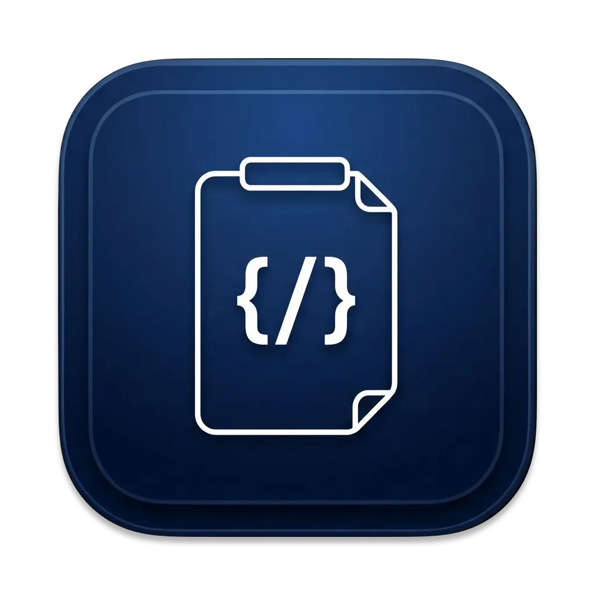

<div align="center">



# Pasta

**The clipboard manager for devs and devops.**

A blazing-fast, Spotlight-style clipboard launcher built with Rust and [GPUI](https://gpui.rs).  
Paste smarter — search, transform, parametrize, and organize everything you copy.

[](https://github.com/yafetgetachew/pasta/actions/workflows/ci.yml)
[](https://github.com/yafetgetachew/pasta/releases/latest)
[](#)
[](#)
[](#)
[](LICENSE)

</div>

<br>

<p align="center">
  
</p>

<br>

## Highlights

- **Neural search** — find clips by *meaning*, not just keywords. On-device embeddings, no cloud, no telemetry.
- **One-key transforms** — shell-quote, base64, JWT decode, JSON format/pretty, URL encode, cert inspect, SHA-256, epoch conversion, and more, a `Tab` away.
- **Parametrize snippets** — turn any copied command into a reusable template with `{{placeholders}}`, filled in on paste. `Cmd + click` to sub-split tokens like `deployment/checkout-api`.
- **Pasta Bowls** — organize clips into tagged collections; export and import as YAML to share with your team.
- **Secrets** — AES-256-GCM encrypted, stored in the macOS Keychain, masked in the UI until revealed.
- **Syntax highlighting** out of the box for Bash, JSON, YAML, TOML, Python, Rust, Go, SQL, and [many more](https://github.com/sublimehq/Packages).
- **Native** — glassmorphic UI, dark/light auto, GPU-accelerated rendering. No Electron, no web views. Global hotkey: `Option + Space` on macOS, `Ctrl + Space` on Linux.

<p align="center">
  
</p>

<p align="center">
  
</p>

<br>

## Install

### macOS

Requires **Apple Silicon** (M1/M2/M3/M4). Intel Macs: build from source.

**From a release (recommended):** grab the latest DMG from the [Releases page](https://github.com/yafetgetachew/pasta/releases/latest), open it, drag **Pasta.app** into **Applications**, then hit `Option + Space`.

Pasta is ad-hoc signed, not Apple-notarized. If Gatekeeper blocks the first launch, either right-click `Pasta.app` → **Open**, or run:

```bash
xattr -dr com.apple.quarantine /Applications/Pasta.app
```

**From source:**

```bash
git clone https://github.com/yafetgetachew/pasta.git
cd pasta
./scripts/install-macos-app.sh
```

### Linux

Wayland-first (tested on KDE Plasma and GNOME; requires a compositor that implements `ext-data-control-v1` or `wlr-data-control-v1`). X11 falls back through GPUI's X11 backend.

**System dependencies** (Fedora / RHEL):

```bash
sudo dnf install libxkbcommon-devel fontconfig-devel wayland-devel \
    dbus-devel openssl-devel libsecret-devel
```

Debian / Ubuntu equivalents: `libxkbcommon-dev libfontconfig1-dev libwayland-dev libdbus-1-dev libssl-dev libsecret-1-dev`.

**Build from source:**

```bash
git clone https://github.com/yafetgetachew/pasta.git
cd pasta
./scripts/install-linux-app.sh
```

The install script builds the release binary, drops a `.desktop` entry and icon into `~/.local/share`, and installs the polkit policy that gates secret reveal and clear-history behind the system authentication dialog. Plain `cargo build --release` also works if you prefer to launch from the CLI.

Global hotkey is `Ctrl + Space`. Tray icon requires a StatusNotifierItem host (built-in on KDE, `gnome-shell-extension-appindicator` on GNOME).

**Secrets on Linux.** Revealing a masked entry or clearing clipboard history triggers a polkit prompt backed by PAM. Password works out of the box. If you have [Howdy](https://github.com/boltgolt/howdy) installed and enrolled (`sudo howdy add`) and your distro's `system-auth` stack includes `pam_howdy.so`, face recognition is tried before the password field appears. Verify the action is registered with `pkaction --action-id com.pasta.launcher.reveal-secret`.

On first enable of **Pasta Brain** (neural search), the app downloads a ~90 MB embedding model into the system cache directory (`~/Library/Caches/pasta-launcher/fastembed/` on macOS, `~/.cache/pasta-launcher/fastembed/` on Linux). Offline or firewall? Pasta falls back to keyword search and you can retry from the menu bar.

<br>

## Contributing

PRs welcome. Good first targets: Windows port, image clipboard support, more transforms (hex, regex extract, markdown strip), automated tests, i18n. Open an issue first if it's a big change.

<br>

## License

MIT — free to use, modify, and distribute. Keep the attribution: Yafet Getachew · [@YafetGetch](https://x.com/YafetGetch) · mailofyafet@gmail.com.

See [LICENSE](LICENSE) for the full text.

<br>

<div align="center">
  <sub>Built with 🦀 Rust + ❤️ for the terminal-loving crowd</sub>
</div>
